# CPSC 449 Event Ticketing System

**Team Members**

| Name | CWID |
|------|-----|
|Carson Christensen | 885402669 |
| Marco Macias | 885389510 |

**Demo Video:** TODO


## POST - Create Organizer

**Endpoint**
```
POST /api/organizers
```

**Description**  
Adds a new organizer to the system. The email must not already be in use.

**Example Request**
```
POST http://localhost:8085/api/organizers
```

**Request Body (JSON)**
```json
{
  "name": "Random Org",
  "email": "randomorg@gmail.com",
  "phone": "123-458"
}
```

### Result
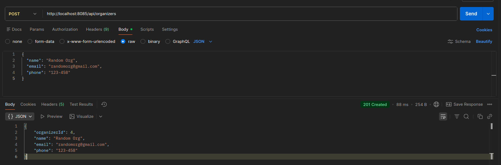

---

## POST - Create Venue

**Endpoint**
```
POST /api/venues
```

**Description**  
Adds a new venue to the system with its name, address, city, and max capacity.

**Example Request**
```
POST http://localhost:8085/api/venues
```

**Request Body (JSON)**
```json
{
  "name": "Rose Bowl",
  "address": "1001 Rose Bowl Dr.",
  "city": "Pasadena",
  "totalCapacity": 90000
}
```

### Result
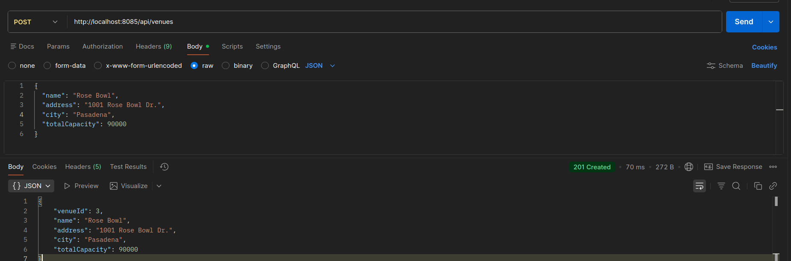

---

## POST - Create Event

**Endpoint**
```
POST /api/events
```

**Description**  
Creates a new event and links it to an existing organizer and venue. Returns `404` if the organizer or venue ID does not exist.

**Example Request**
```
POST http://localhost:8085/api/events
```

**Request Body (JSON)**
```json
{
  "title": "CSUF ECS Expo",
  "description": "A place where ECS students showcase their projects",
  "eventDate": "2026-05-15T19:00:00",
  "status": "UPCOMING",
  "organizerId": 2,
  "venueId": 2
}
```

### Result
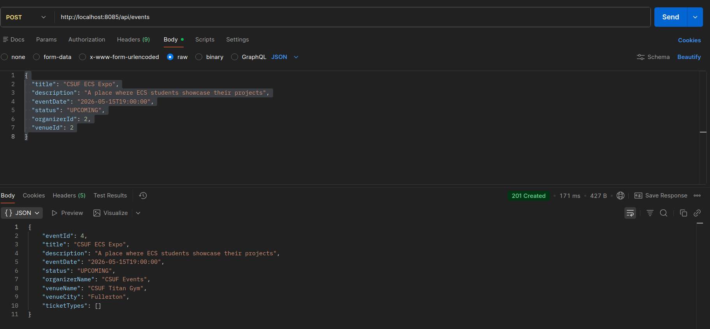

---

## GET - List All Upcoming Events

**Endpoint**
```
GET /api/events
```

**Description**  
Returns a list of all events marked as `UPCOMING`. Events with any other status are not included.

**Example Request**
```
GET http://localhost:8085/api/events
```

### Result
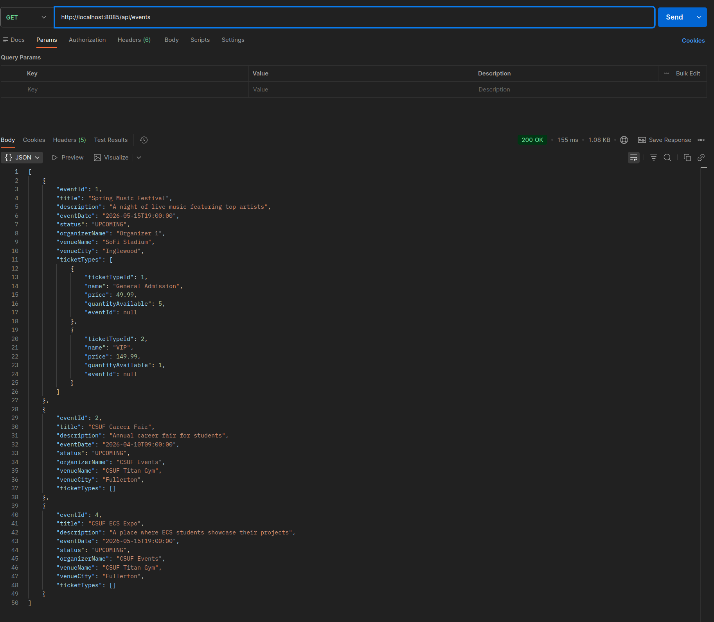

---

## GET - Get Event by ID

**Endpoint**
```
GET /api/events/{id}
```

**Description**  
Returns the details of a single event, including the organizer name, venue name, and all available ticket types.

**Example Request**
```
GET http://localhost:8085/api/events/1
```

### Result
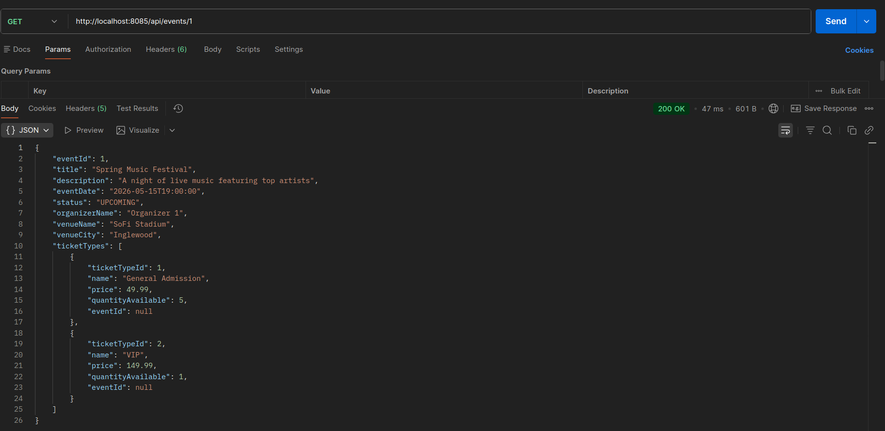

---

## POST - Register Attendee

**Endpoint**
```
POST /api/attendees
```

**Description**  
Registers a new attendee. Returns `400` if the email is already taken.

**Example Request**
```
POST http://localhost:8085/api/attendees
```

**Request Body (JSON)**
```json
{
  "name": "Joe Smith",
  "email": "joesmith123@fakeemail.com"
}
```

### Result
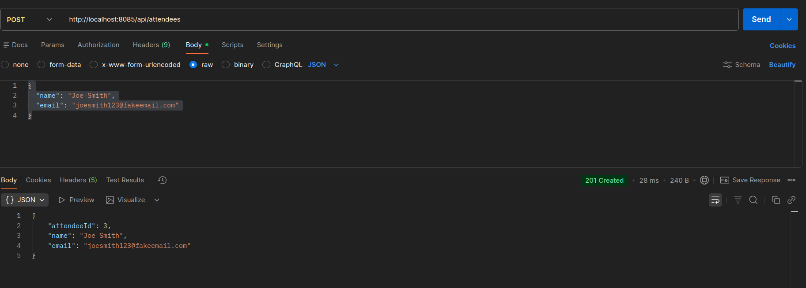

---

## POST - Book a Ticket

**Endpoint**
```
POST /api/bookings
```

**Description**  
Books a ticket for an attendee. The following rules are enforced:
- Returns `400` with `"Sorry, this ticket type is sold out."` if no tickets are left
- Returns `400` with `"You have already booked this ticket type."` if the attendee booked this ticket before
- Reduces `quantityAvailable` by 1
- Generates a booking reference in the format `TKT-{year}-{00001}`
- Sets `paymentStatus` to `CONFIRMED`
- The entire operation is `@Transactional`

**Example Request**
```
POST http://localhost:8085/api/bookings
```

**Request Body (JSON)**
```json
{
  "attendeeId": 1,
  "ticketTypeId": 1
}
```

### Result - Success
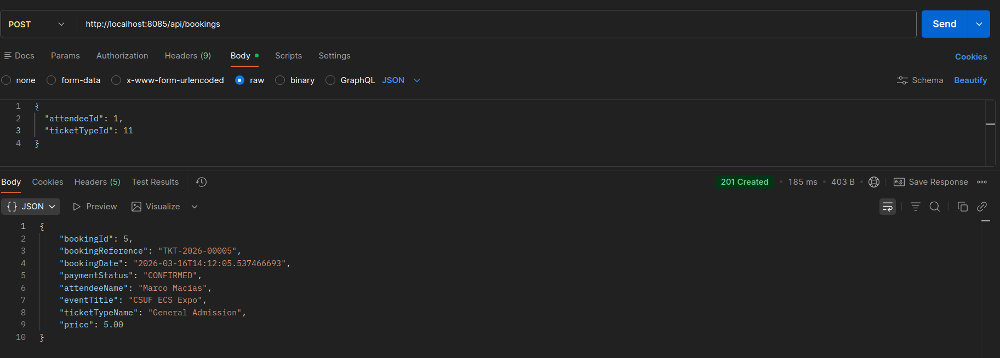

### Result - Sold Out (400)
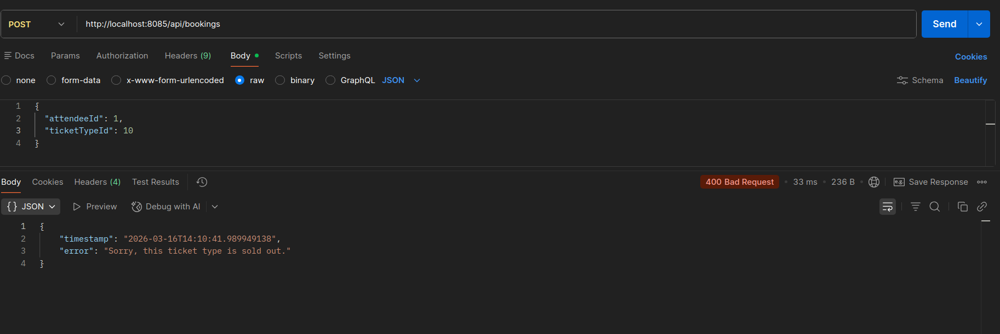

### Result - Duplicate Booking (400)
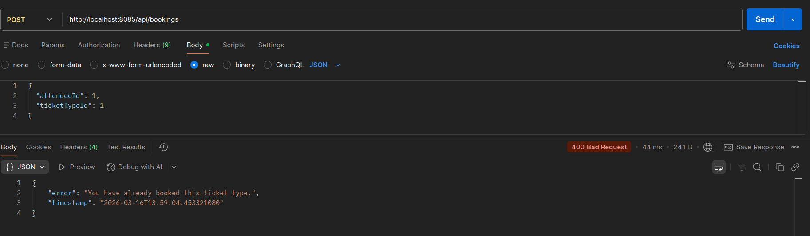

---

## PUT - Cancel Booking

**Endpoint**
```
PUT /api/bookings/{id}/cancel
```

**Description**  
Cancels a booking by its ID. The ticket is added back to the available inventory. Returns `400` if the booking is already cancelled. No request body needed.

**Example Request**
```
PUT http://localhost:8085/api/bookings/5/cancel
```

### Result - Success
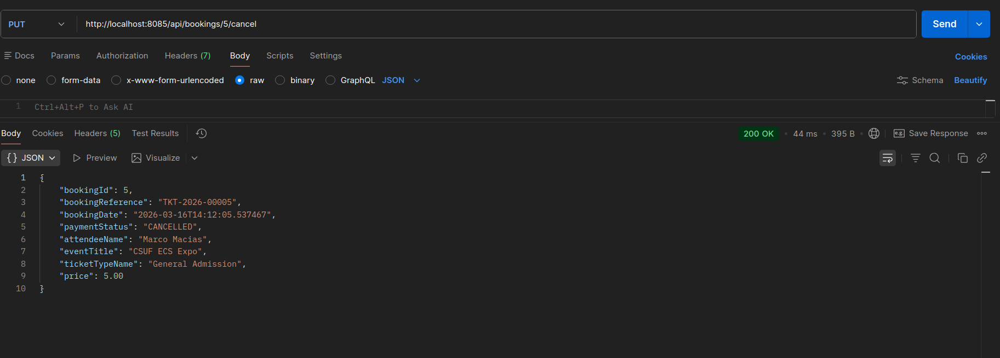

### Result - Already Cancelled (400)
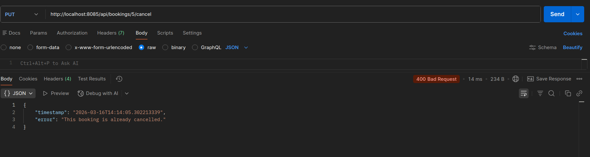

---

## GET - Get Total Revenue for Event

**Endpoint**
```
GET /api/events/{id}/revenue
```

**Description**  
Returns the total revenue for an event by adding up the prices of all `CONFIRMED` bookings. Cancelled bookings are not counted.

**Example Request**
```
GET http://localhost:8085/api/events/1/revenue
```

### Result
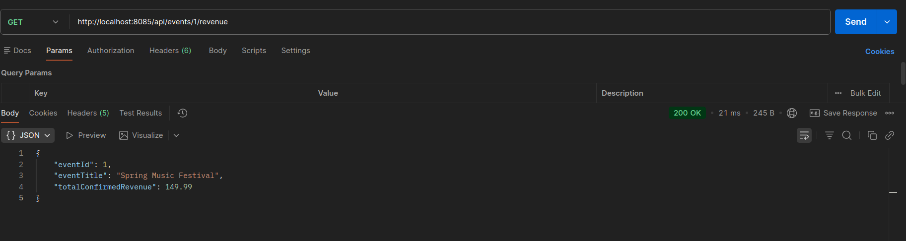

---

## GET - Get All Bookings for Attendee

**Endpoint**
```
GET /api/attendees/{id}/bookings
```

**Description**  
Returns all bookings made by a specific attendee, including the event title, ticket type, price, booking reference, and payment status for each one.

**Example Request**
```
GET http://localhost:8085/api/attendees/1/bookings
```

### Result
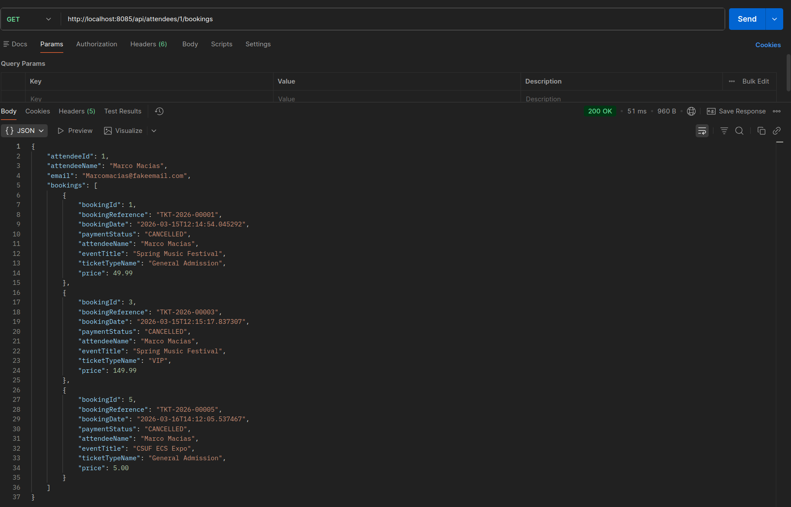